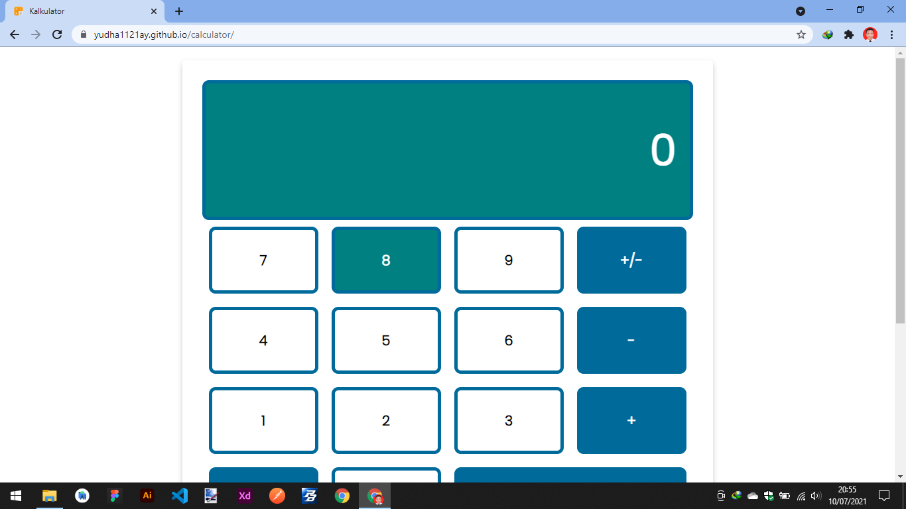
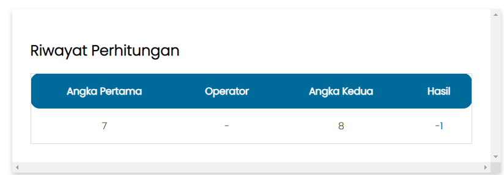
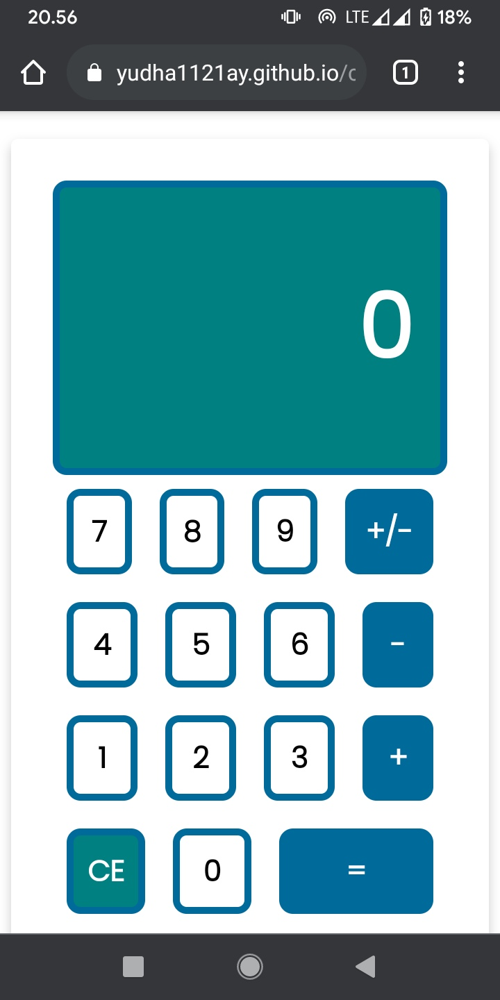

# WEB App Kalkulator Sederhana
<h1> Live Preview : <a href="https://yudha1121ay.github.io/calculator"> Link </a></h1>

<h3> Dibuat dengan :</h3>
<ul>
    <li>HTML5</li>
    <li>CSS3, Flexbox</li>
    <li>Vanilla JS</li>
</ul>

<h3> Fitur : </h3>
<ul>
    <li>Menggunakan local storage untuk menyimpan riwayat operator</li>
    <li>Responsive di mobile screen</li>
</ul>

<h3> Screenshot : </h3>
<ul>
    <li> Desktop Screen </li>
    
     
    <li> Riwayat </li>
    
     
    <li> Mobile Screen </li>
    
</ul>
